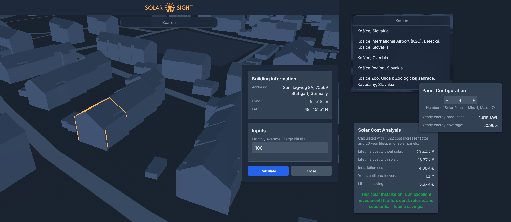

# Solar Sight

Render 3D cities in web. Request solar data for specific buildings and do cost analysis.
Project uses Next.js + Resium + Cesium ion + Mapbox Styles API + Google API.

## Showcase



CityGML data used in showcase image was obtained from the German Federal Statistical Office under the [”Data Licence Germany – Attribution – Version 2.0” license](https://www.govdata.de/dl-de/by-2-0). Data can be downloaded [here](<https://opengeodata.lgl-bw.de/#/(sidenav:product/12)>).

## Features

### Styling

[Tailwind](https://tailwindcss.com/) styling. Smooth blur animations. Initial load animation.

### Search bar

Search bar with keyboard support. Uses Google Places API and navigates to the location.

### Selecting Resium feature (building)

Highlighting on hover and selecting 3D features on the map. Feature info card is opened that uses [reverse geocoding](https://developers.google.com/maps/documentation/geocoding/requests-reverse-geocoding) in order to lookup address.

### Calculating solar data

In the feature info card user can request calculation of solar data. This request uses Google Solar API. With this data the component calculates solar cost analysis.

## Technologies

### Next.js

[Next.js](https://nextjs.org/docs#what-is-nextjs) meta framework is used to render web application and make server requests.

### Resium

In order to render maps [Resium](https://resium.reearth.io/) was used. Resium is a library of React components for [Cesium.js](https://cesium.com/platform/cesiumjs). In order to make this library work cesium files are required in `/public/cesium` folder.

### Cesium ion

This project uses [Cesium ion™](https://cesium.com/platform/cesium-ion/) to host 3D content and serve it to the app.
Specifically, it uses [3D Tiles](https://www.ogc.org/standard/3dtiles/) and serves them to the client.
Cesium ion supports uploading [CityGML](https://www.ogc.org/standard/citygml/) data and converting them to 3D tiles.
(CityGML data needs to be converted to the 3D tiles data format if you want to serve this kind of data in the web)

### Mapbox Styles API

[Mapbox Styles API](https://docs.mapbox.com/api/maps/styles/) provides interface for custom map styles.
Project uses [Static Tiles API](https://docs.mapbox.com/api/maps/static-tiles/) and retrieves the style with url of format:
`https://api.mapbox.com/styles/v1/{username}/{style_id}/tiles/{tilesize}/{z}/{x}/{y}{@2x}?access_token=${mapbox_access_token}`

### Google API

[Google API](https://console.cloud.google.com/apis/library) is used in this project for multiple purposes.
To retrieve addresses and coordinates [Places API](https://developers.google.com/maps/documentation/places/web-service/overview) and [Geocoding API](https://developers.google.com/maps/documentation/geocoding/overview) are used. Solar data is retrieved via [Solar API](https://developers.google.com/maps/documentation/solar/overview).

---

## Setup

### Environment variables

Environment variables are stored in `.env`, for local development don't forget to use `.env.local` in order to not push your secrets. Read more on how Next.js handles environment variables [here](https://nextjs.org/docs/pages/building-your-application/configuring/environment-variables).

Below this section there is detailed information how to retrieve each variable.

```env
# Public
NEXT_PUBLIC_MAPBOX_ACCESS_TOKEN=
NEXT_PUBLIC_CESIUM_ACCESS_TOKEN=
NEXT_PUBLIC_CESIUM_ASSET_ID=96188                     # Cesium OSM Buildings
NEXT_PUBLIC_MAPBOX_STYLE_USERNAME=mimo-mi             # Style from showcase
NEXT_PUBLIC_MAPBOX_STYLE_ID=cly1ljlzt003x01qvapsu4ug5 # Style from showcase

# Server
GOOGLE_API_KEY=
```

### Cesium

1. Create [Cesium ion](https://ion.cesium.com/signup/) account
2. Create [Cesium access token](https://ion.cesium.com/tokens?page=1). Only `assets:read` scope is required
3. Copy access token to environment variables

Optional: Create assets and set asset id into the environment variables.

### Mapbox Styles

1. Create [Mapbox](https://account.mapbox.com/auth/signup/) account
2. Create style in [Mapbox Studio](https://studio.mapbox.com/)
3. Copy Mapbox username and style id to environment variables

### Google API

Highly recommended to use [gcloud CLI](https://cloud.google.com/sdk/docs/install) as the Google Console UI is not good.

Run bash script located in `/tools/gcloud-setup.sh`. In case not ran on unix system but inside of WSL use `/tools/gcloud-setup-wsl.sh` which uses CRLF line endings.

`./tools/gcloud-setup.sh "project-name" "api-key-name"`

This script installs jq, gcloud and gcloud beta. It prompts to authenticate with gcloud, then it creates/selects project, checks if billing is setup (required in order to use API). If billing is not setup, it will prompt to create billing and re-run the script.

If billing is setup then it should create new Google Cloud project and create API key with necessary permissions.
Set this api key into the environment variables.

If setup without gcloud is desired, then refer to Google documentation and create api key for Geocoding, Places and Solar API. Recommended to look at the script to understand setup.

---

## Starting the app

```bash
npm run dev
# or
yarn dev
# or
pnpm dev
# or
bun dev
```

This starts the application on [localhost:3000](http://localhost:3000).
There is a placeholder "home" page. In order to navigate to the main page navigate to [/dashboard](http://localhost:3000/dashboard)

## Deploying the app

### Fly.io

Application can be easily deployed to [Fly.io](https://fly.io/docs/launch/deploy/).
Environment variables should be passed using `--build-arg`. See section (#devops) below, this is done automatically via GitHub Actions.

### Vercel

Application can be easily deployed to [Vercel](https://vercel.com).

### DevOps

There is continuous delivery setup done via GitHub Actions:

- [Fly.io pipeline](.github/workflows/cd-vercel.yml)
- [Vercel pipeline](.github/workflows/cd-vercel.yml)

Make sure to either set `FLY_API_TOKEN` or `VERCEL_TOKEN` depending on platform used in your GitHub environment variables.
When using Fly.io make sure to set all variables and secrets as GitHub environment variables.
When using Vercel make sure to set all variables and secrets as Vercel environment variables.

## Future of the project

There is no plan to maintain this project further for now, might change in the future.
Ideas not implemented:

- Database storing fetched data from Google API (cost cutting)
- Aggregate showcase of solar data (e.g. coloring roofs of houses)

## Known problems

`reactStrictMode` had to be set to false due to some Resium issuess (hunch: it could be due to disposing of resium features).
This problem wasn't investigated in depth.

## Contributors

### Sebastian Stupak

- Technologies research, development, documentation

### Michelle Yvonne Jürgens

- Solar research, development, design
